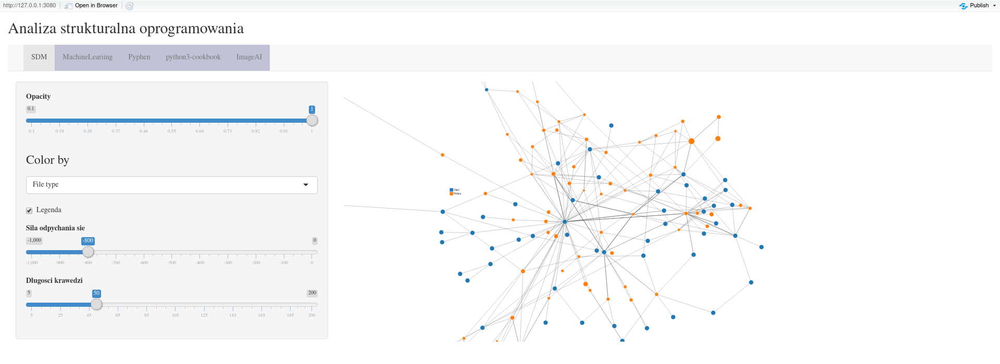

# Repo Analytics

RShiny application for exploratory analysis of source code dependencies in Git repositories. Capable of cloning repos, analyzing them and visualizing dependencies graphs.

Project prepared as a university project for R programming class.

## Dependencies graph construction

Application recursively searches for source code files in repository directory and analyzes their contents in search for import instructions (Python and R supported). Once import instructions are extracted, a directed acyclic graph is constructed and handed over to RShiny for visualization.
