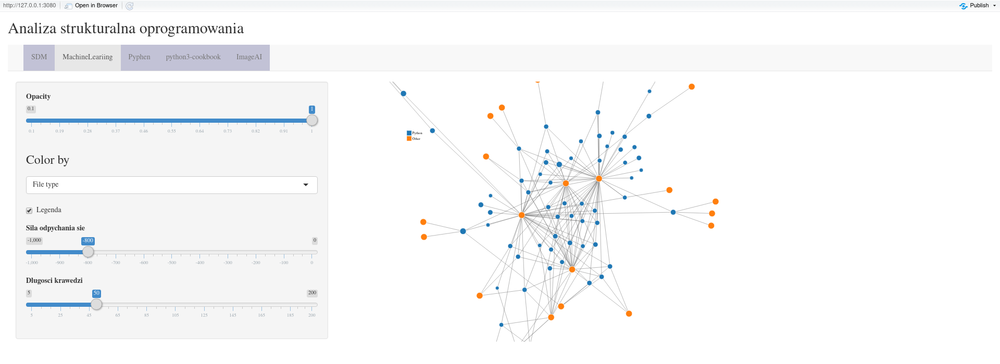
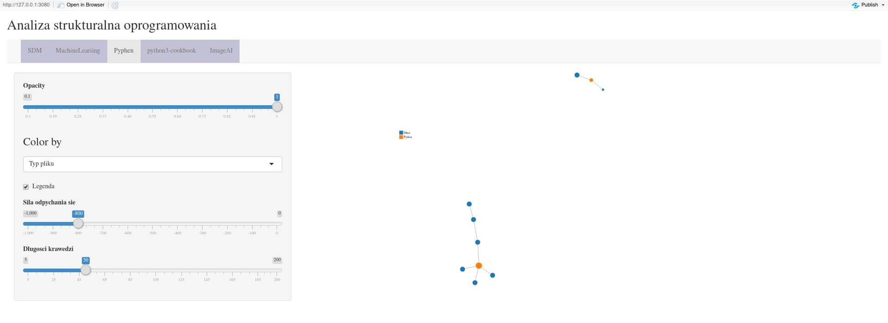
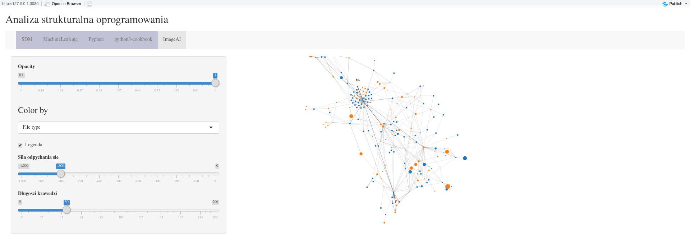

---
title:
- Analiza strukturalna oprogramowania
author:
- Mateusz Jakubczak, Karol Oleszek
theme:
- Copenhagen
header-includes:
- \usepackage{tikz}
---

# Zawartość prezentacji

Zawartość prezentacji:

- Wprowadzenie
- Struktura projektu
- Opis danych
- Informacje teoretyczne
- Prezentacja wyników

# Wprowadzenie

Celem projektu jest stworzenie aplikacji umożliwiającej analizę strukturalną dowolnego kodu źródłowego. Przedmiotem badania jest struktura zależności w projekcie przedstawiona w formie grafu.

# Wprowadzenie

Pliki kodu źródłowego zawierają różne instrukcji importowania innych plików. Nasza aplikacja używa tych informacji do stworzenia grafu struktury projektu. Pliki są parsowane i przedstawiane w postaci grafu.

# Struktura projektu

Pliki:

- ui.R, server.R aplikacja R Shiny
- requirements.txt zewnętrzne biblioteki
- load_repos.R skrypt generujący dane
- prezentacja.md/pdf prezentacja

# Podział pracy

Składniki projektu:

- Aplikacja Shiny Mateusz Jakubczak
- Prezentacja Karol Oleszek
- Skrypty przetwarzające dane Praca wspólna

# Opis danych

Dane pobrane zostały z publicznych repozytoriów na stronie Github.com.
Mają one forme folderów zawierającyh wiele plików kodu źródłowego.

# Opis danych

Do projektu dołączone są następujące repozytoria:

- ImageAI
- PySDM
- Pyphen
- MachineLearningAlgorithms
- python3cookbook

# Informacje teoretyczne

Graf jest zbiorem wierzchołków i krawędzi.

\begin{tikzpicture}
  [scale=.8,auto=left,every node/.style={circle,fill=blue!20}]
  \node (n6) at (1,10) {6};
  \node (n4) at (4,8)  {4};
  \node (n5) at (8,9)  {5};
  \node (n1) at (11,8) {1};
  \node (n2) at (9,6)  {2};
  \node (n3) at (5,5)  {3};

  \foreach \from/\to in {n6/n4,n4/n5,n5/n1,n1/n2,n2/n5,n2/n3,n3/n4}
    \draw (\from) -- (\to);

\end{tikzpicture}

# Informacje teoretyczne

W naszym projekcie wierzchołkami są pliki z kodem, a krawędziami operacje importowania.

\begin{tikzpicture}
  [scale=.8,auto=left,every node/.style={circle,fill=blue!20}]
  \node (n6) at (1,10) {test.py};
  \node (n4) at (4,8)  {a.py};
  \node (n5) at (8,9)  {l.R};
  \node (n1) at (11,8) {j.cpp};
  \node (n2) at (9,6)  {data.json};
  \node (n3) at (5,5)  {t.md};

  \foreach \from/\to in {n6/n4,n4/n5,n5/n1,n1/n2,n2/n5,n2/n3,n3/n4}
    \draw (\from) -- (\to);

\end{tikzpicture}

# Informacje teoretyczne

Formalnie:

- $\mathbb{V}$ jest zbiorem wierzchołków
- $\mathbb{E} \subset \{\{x, y\} | (x, y) \in \mathbb{V}^2 \land  x \neq y\}$ jest zbiorem krawędzi.

# Prezentacja wyników

Aplikacja Shiny z modułem networkD3 umożliwiła nam zwizualizować strukturę projektów w postaci interaktywnego grafu.

# Prezentacja wyników

Aplikacja umożliwia wizualizacje w postaci grafu różnych cech plików (np. rozmiaru, typu, itd.).

# Prezentacja wyników

# Prezentacja wyników

# Prezentacja wyników

# Prezentacja wyników

# Prezentacja wyników

Prezentowane projekty wykazują duże zróżnicowanie strukturalne. Występują pliki importowane przez dużą liczbę plków co sugeruje ich wysoką istotność.

# Koniec

Prezentacja została wykonana przy użycie programu __pandoc__ oraz technologii __\LaTeX__.
